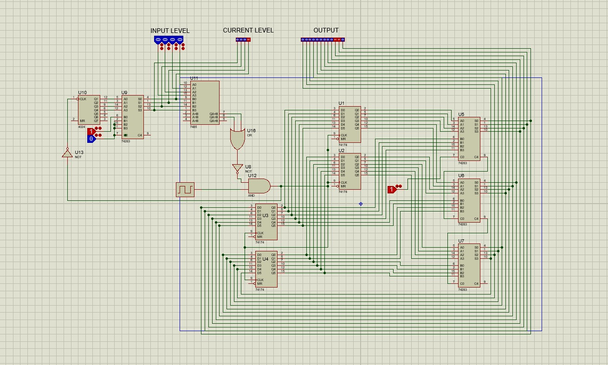

Here’s a well-structured **GitHub README** for your **Fibonacci Sequence Implementation in Proteus**:  

---

# **Fibonacci Sequence Implementation using Proteus**  

 
## 📌 **Project Overview**  
This project demonstrates the **Fibonacci sequence generation** using a **microcontroller-based embedded system** in **Proteus**. The simulation illustrates how the Fibonacci series is computed and displayed on an **LCD screen**, making it suitable for **educational and embedded systems applications**.  

## 🚀 **Technologies & Tools Used**  
- **Proteus** – Circuit simulation & microcontroller-based system design  
- **Microcontroller (e.g., ATmega16, PIC16F877A, or 8051)** – Implements the Fibonacci logic  
- **C/Assembly Language** – Code for Fibonacci sequence computation  
- **LCD Display (16x2)** – Real-time visualization of Fibonacci numbers  
- **Keil uVision/MPLAB/XC8** – Code compilation and debugging  

## 🔧 **Project Features**  
✅ **Fibonacci Series Calculation** – Computes Fibonacci numbers iteratively or recursively.  
✅ **LCD Display Integration** – Displays computed Fibonacci numbers in real-time.  
✅ **Efficient Memory Usage** – Optimized for minimal stack usage and better performance.  
✅ **Embedded System Simulation** – Simulated in **Proteus** for real-world microcontroller applications.  

## 📜 **Project Structure**  
```
📂 Fibonacci-Proteus/
 ├── 📁 Fibonacci.pdsrj     # Contains the .pdsprj file and circuit design
 ├── 📝 README.md            # Documentation (this file)
 ├── 📷 Screenshots/         # Images of the simulation output
```

## 🛠 **Installation & Simulation Guide**  
1. **Clone the repository**  
   ```bash
   git clone https://github.com/Aayush-Patidar/Fibonacci-Proteus.git
   cd Fibonacci-Proteus
   ```
2. **Open the Proteus file**  
   - Navigate to the **Proteus_Project** folder and open `Fibonacci.pdsprj` in **Proteus 8.0 or later**.  
3. **Load the microcontroller code**  
   - Compile the **C/Assembly code** in **Keil uVision** or **MPLAB XC8**.  
   - Upload the `.hex` file to the **microcontroller in Proteus**.  
4. **Run the simulation**  
   - Click the **Run** button in Proteus and observe the Fibonacci series on the **LCD screen**.  

## 📸 **Project Demo**  
*(Add simulation screenshots here)*  

## 🔗 **GitHub Repository**  
[👉 Fibonacci Sequence in Proteus](https://github.com/Aneket-Burman/Fibonacci-Proteus) *(Replace with actual link once uploaded)*  

---

This **README** is **structured, informative, and optimized** for **GitHub**, making it easy for others to understand and use your project. Let me know if you need any changes! 🚀
